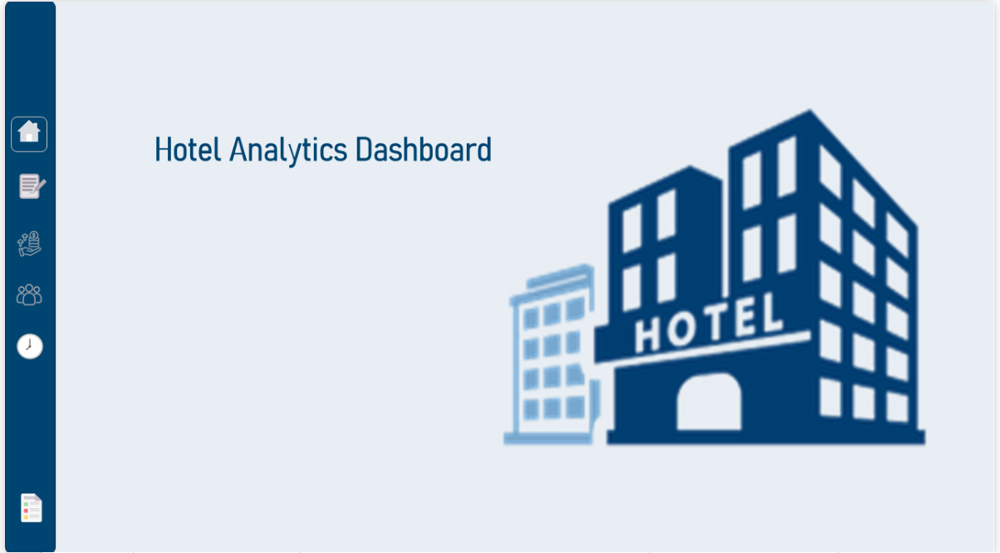
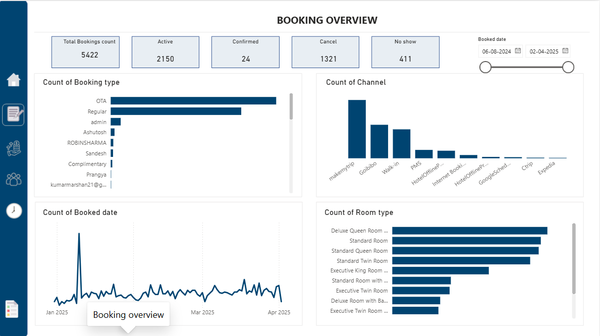
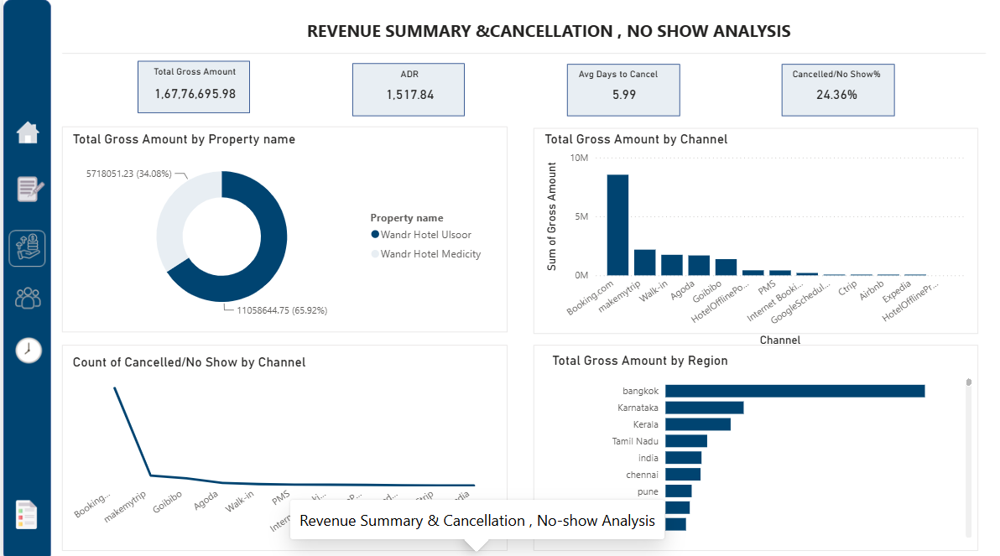
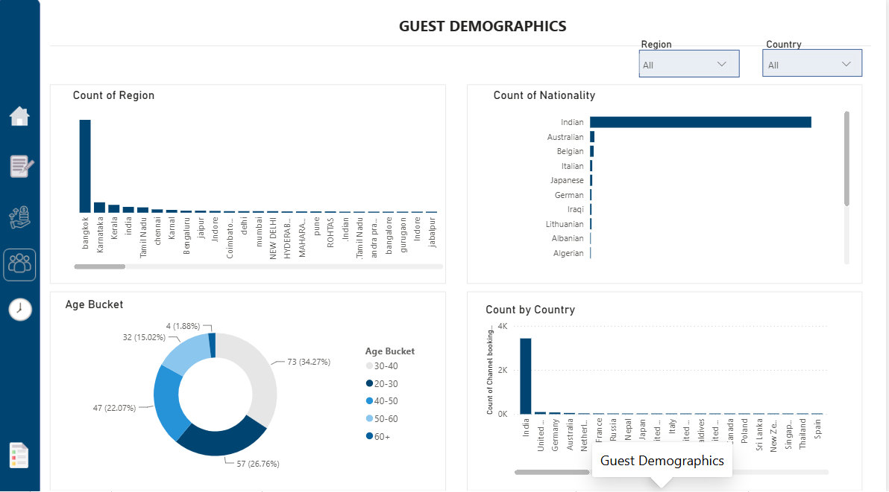
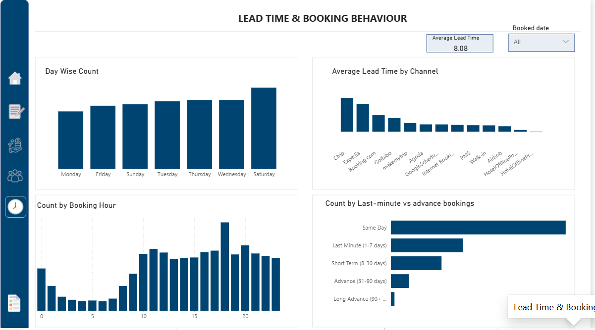

# 🏨 Hotel Analytics Dashboard

## 📌 Project Overview

The **Hotel Analytics Dashboard** is an interactive Power BI solution designed to provide hotel management with actionable insights into booking performance, revenue trends, cancellation patterns, guest demographics, and reservation behavior.

The dashboard consolidates multiple business metrics into a single reporting solution, enabling stakeholders to monitor key performance indicators (KPIs) and make data-driven decisions.

---

## 🎯 Business Problem

Hotel management relied on manual reports to analyze operational performance, making it difficult to identify trends and monitor business KPIs efficiently.

The key challenges included:

- Limited visibility into booking performance
- Difficulty tracking revenue and cancellations
- No centralized reporting for guest demographics
- Time-consuming manual reporting process

---

## 💡 Solution

Developed an interactive **Power BI Dashboard** to centralize hotel performance reporting with dynamic visualizations and KPI tracking.

The solution enables users to:

- Monitor booking trends
- Analyze revenue performance
- Track cancellation and no-show rates
- Understand guest demographics
- Evaluate booking lead times
- Interact with reports using slicers and navigation buttons

---

# 🛠️ Tools & Technologies

- Microsoft Power BI
- Power Query
- DAX
- Microsoft Excel

---

# 📊 Dashboard Pages

## 🏠 Home

Provides an interactive landing page with navigation to all analytical reports.



---

## 📅 Booking Overview

Provides insights into hotel booking performance.

### Key Metrics

- Total Bookings
- Booking Status
- Booking Trends
- Reservation Analysis



---

## 💰 Revenue Summary & Cancellation Analysis

Analyzes revenue performance and booking cancellations.

### Key Metrics

- Total Revenue
- Cancellation Rate
- No-show Analysis
- Revenue Trends



---

## 👥 Guest Demographics

Provides customer segmentation and demographic insights.

### Key Metrics

- Guest Distribution
- Customer Type
- Country Analysis
- Booking Source



---

## ⏳ Lead Time Analysis

Analyzes booking lead times and reservation behavior.

### Key Metrics

- Average Lead Time
- Booking Window
- Reservation Distribution
- Booking Patterns



---

# 📈 Dashboard Features

- Interactive Navigation
- KPI Cards
- Dynamic Filters
- Drill-down Analysis
- Slicers
- Responsive Report Design
- Cross-page Navigation

---

# 📊 Business Value

This dashboard helps hotel management to:

- Improve occupancy planning
- Monitor revenue performance
- Reduce cancellation impact
- Analyze customer behavior
- Support data-driven decision-making
- Eliminate manual reporting

---

# 📁 Repository Structure

```
Hotel-Analytics-Dashboard
│
├── README.md
├── Hotel Analytics Dashboard.pbix
├── Hotel Analytics Dashboard.pdf
├── Dataset.xlsx
└── Images
    ├── Home.png
    ├── BookingOverview.png
    ├── RevenueSummary.png
    ├── GuestDemographics.png
    └── LeadTime.png
```

---

# 🚀 Future Enhancements

- Predictive occupancy forecasting
- Revenue forecasting
- Customer segmentation using advanced analytics
- Automated report refresh
- Power BI Service deployment
- Mobile-optimized dashboard

---

# 📷 Dashboard Preview

| Dashboard | Preview |
|------------|---------|
| Home | ✅ |
| Booking Overview | ✅ |
| Revenue Summary | ✅ |
| Guest Demographics | ✅ |
| Lead Time | ✅ |

---

# 👨‍💻 Author

**Aarthy**

Business Analyst | Power BI Developer

**Skills**

- Business Analysis
- Power BI
- SQL
- DAX
- Power Query
- Excel
- Requirements Gathering
- BRD / FRD
- User Stories
- UAT

---

⭐ If you found this project useful, feel free to star the repository.
